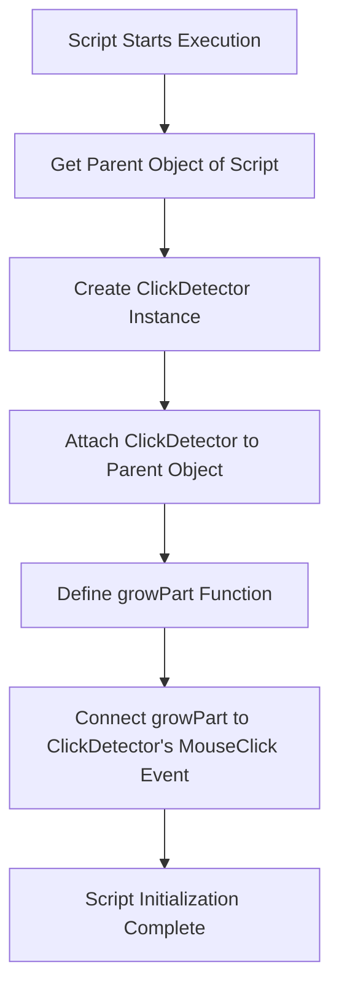
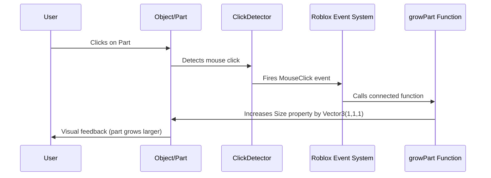
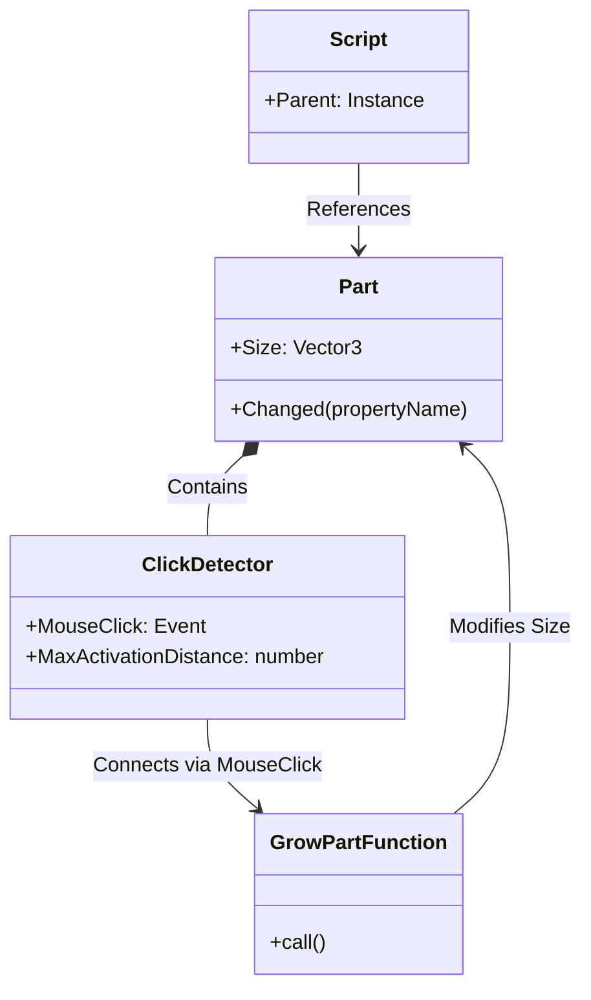
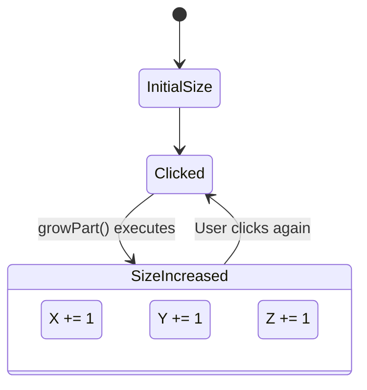

# Roblox Code Execution Flow Visualization

## Overview

This document visualizes the execution flow of the following Roblox script:

```lua
local part = script.Parent  
-- parent contains the script 

local clickDetector = Instance.new("ClickDetector", part)

local function growPart()
	part.Size = part.Size + Vector3.new(1, 1, 1)  -- Increase size
end

clickDetector.MouseClick:Connect(growPart)
```

## Script Initialization Flow



## Runtime Event Flow



## Detailed Component Breakdown



## Memory and Property States

The following diagram shows how the part's Size property changes when clicked:



## Technical Implementation Details

1. **ClickDetector Creation**: The `Instance.new("ClickDetector", part)` call creates a new ClickDetector object and immediately parents it to the part.

2. **Event Connection**: The `Connect` method creates a persistent connection between the MouseClick event and the growPart function.

3. **Vector3 Addition**: When the part grows, the code uses Vector3 addition to increase all three dimensions simultaneously.

## Common Debugging Tips

- If clicking doesn't work, check that:
  - The script is properly parented to the intended part
  - The part is anchored or properly constrained
  - The ClickDetector's MaxActivationDistance is appropriate

- If the part grows unexpectedly:
  - Check for multiple scripts that might be modifying the same part
  - Verify the Vector3 values in the growPart function